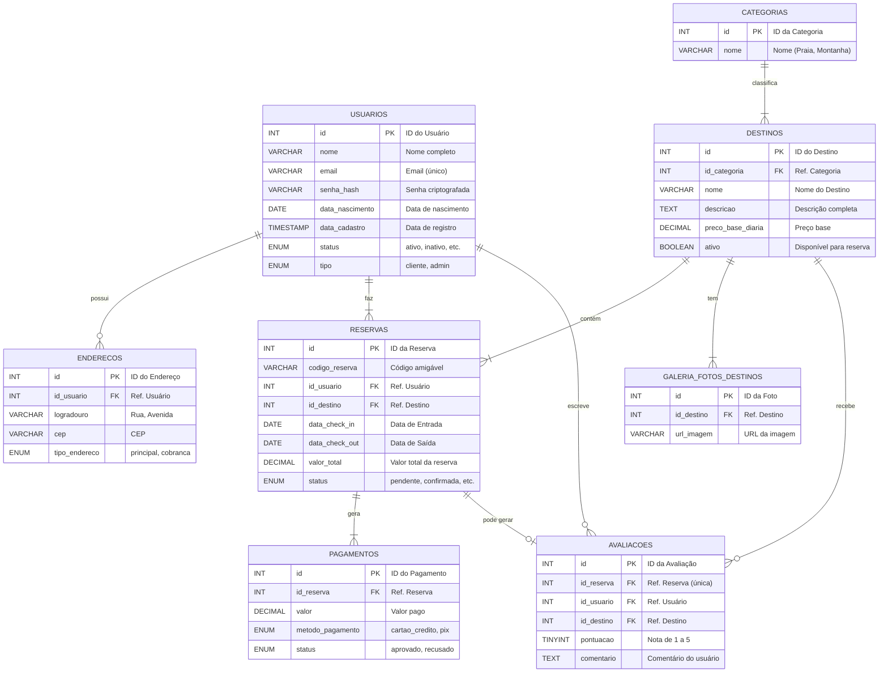

# Projeto de Banco de Dados para Agência de Viagens


## 1. Introdução

Este projeto consiste num esquema de banco de dados relacional robusto e escalável, concebido para uma plataforma completa de agência de viagens online. O modelo foi desenvolvido utilizando as melhores práticas de normalização, segurança e integridade de dados para suportar funcionalidades complexas do mundo real.

O objetivo é servir como uma base sólida para o back-end de uma aplicação que gerencia usuários, destinos, reservas, pagamentos e avaliações.

## 2. Funcionalidades Principais

A estrutura do banco de dados suporta as seguintes funcionalidades:

* **Gestão de Usuários:** Cadastro, autenticação segura (com senhas hasheadas), perfis e tipos de usuário (cliente, admin).
* **Catálogo de Destinos:** Armazenamento detalhado de destinos, classificados por categorias e com galerias de fotos.
* **Sistema de Reservas:** Ciclo completo de uma reserva, desde a solicitação até a finalização, com controle de datas, passageiros e valores.
* **Processamento de Pagamentos:** Integração com sistema de pagamentos, registrando cada transação associada a uma reserva.
* **Avaliações e Ratings:** Permite que usuários postem avaliações e notas para os destinos que visitaram, criando um sistema de feedback.
* **Gestão de Endereços:** Suporte a múltiplos endereços por usuário (principal, cobrança, etc.).

## 3. Diagrama de Entidade-Relacionamento (ERD)

O diagrama abaixo ilustra a arquitetura do banco de dados, as tabelas e seus relacionamentos.



## 4. Descrição das Tabelas

* **`usuarios`**: Tabela central para informações de todos os usuários da plataforma. Inclui dados para autenticação, perfil e controle de acesso.
* **`enderecos`**: Tabela normalizada para armazenar um ou mais endereços por usuário, seguindo boas práticas de design.
* **`categorias`**: Tabela de lookup para classificar os destinos (ex: Praia, Montanha, Aventura), permitindo a fácil adição de novos tipos.
* **`destinos`**: Coração do catálogo, com todas as informações detalhadas sobre os locais turísticos oferecidos.
* **`galeria_fotos_destinos`**: Permite associar múltiplas imagens a um mesmo destino.
* **`reservas`**: Registra todas as transações de reserva, conectando um usuário a um destino em um período específico.
* **`pagamentos`**: Tabela crucial para o negócio, rastreia o status financeiro de cada reserva.
* **`avaliacoes`**: Ferramenta de engajamento que permite aos usuários compartilhar suas experiências, associando uma nota e comentário a uma reserva concluída.

## 5. Tecnologias Utilizadas

* **SGBD:** MariaDB 11.x (compatível com MySQL 8.x)
* **Linguagem:** SQL (DDL - Data Definition Language)
* **Charset/Collation:** `utf8mb4` / `utf8mb4_unicode_ci` para suporte completo a caracteres internacionais e emojis.

## 6. Como Executar

Para criar este banco de dados em seu ambiente local, siga os passos:

1.  **Pré-requisitos:**
    * Ter um servidor de banco de dados MariaDB ou MySQL instalado.
    * Ter um cliente de banco de dados, como DBeaver, HeidiSQL, ou acesso à linha de comando (`mysql`).

2.  **Clone o repositório (exemplo):**
    ```bash
    git clone [https://github.com/ferrazmarcius/bd-viagens](https://github.com/ferrazmarcius/bd-viagens.git)
    cd seu-repositorio-aqui
    ```

3.  **Importe o arquivo `.sql`:**
    * **Via Linha de Comando:**
        ```bash
        mysql -u SEU_USUARIO -p viagens < nome_do_arquivo.sql
        ```
        (Você precisará criar o banco de dados `viagens` primeiro com `CREATE DATABASE viagens;`)

    * **Via Ferramenta Gráfica (phpMyAdmin, DBeaver, etc.):**
        * Crie um novo banco de dados chamado `viagens`.
        * Selecione o banco de dados.
        * Use a função "Importar" ou "Executar Script SQL" e selecione o arquivo `.sql` deste projeto.

## 7. Licença

Este projeto está licenciado sob a Licença MIT. Veja o arquivo `LICENSE` para mais detalhes.

## 8. Desenvolvedor

* **Marcius Ferraz**
    * [LinkedIn](https://www.linkedin.com/in/marcius-ferraz/)
    * [GitHub](https://github.com/ferrazmarcius)
    * [DIO](https://www.dio.me/users/mferraz_xmi)